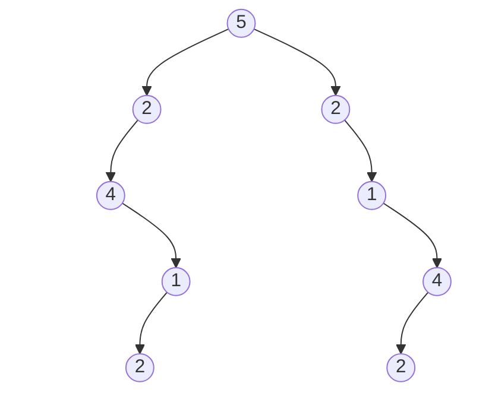

# First attempt

I first wrote the code in [attempt_01.py](./attempt_01.py). It passed 198 out of 202 test cases, but it failed on this tree:

`root = [5,2,2,4,null,null,1,null,1,null,4,2,null,2,null]`



The problem is that the `1` and `4` nodes appear in different orders in the left and right subtrees. Because of that, comparing the left and right slices of the inorder traversal made them look identical.

For example:

```python
l = ['null', '4', '2', '1', 'null', '2', 'null', '5', 'null', '2', 'null', '1', '2', '4', 'null']

l[:mid - 1] = ['null', '4', '2', '1', 'null', '2', 'null']
l[-1:-mid:-1] = ['null', '4', '2', '1', 'null', '2', 'null']
```

# Second attempt

I then wrote [attempt_02.py](./attempt_02.py). That version passed 199 out of 201 cases.

# Final attempt

Finally, I came up with the working solution in [solution.py](./solution.py). 